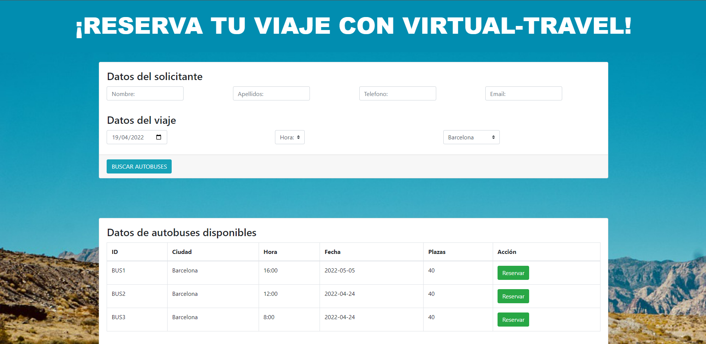

# VIRTUAL-TRAVEL
## Ejercicio final entorno cloud
La aplicación a desarrollar será el backend de una página web para la agencia de autobuses
‘VIRTUAL-TRAVEL’  

La aplicación constará de dos aplicaciones a su vez:  
- **BackWeb**: Servidor que recibirá las peticiones del FRONT donde se realizan las reservas.  

- **BackEmpresa**: Aplicación instalada en la empresa. Se comunicará con ‘BackWeb’ pero también podrá recibir reservas externas. 

La aplicación está desarrollada sobre un entorno para facilitar su procesamiento

### Página principal

